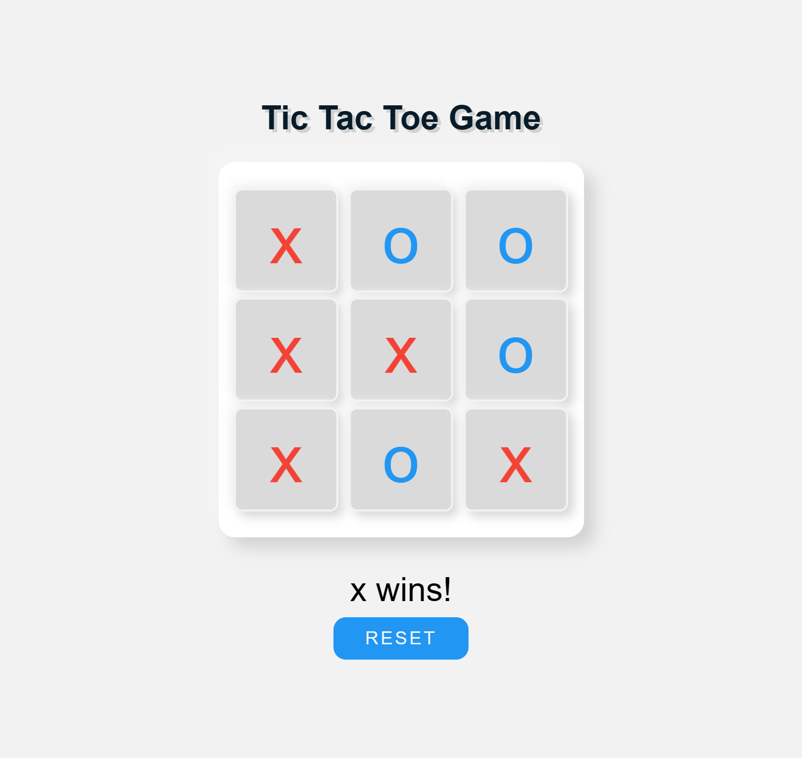

# Project List

| Project Name   | Live Demo |
|----------------|-----------|
| P01_StopWatch  | [Live Demo](https://arise-aizen-404.github.io/Coding-With-Nisha-Projects/P01_StopWatch/)         |
| P02_PopUp      | [Live Demo](https://arise-aizen-404.github.io/Coding-With-Nisha-Projects/P02_PopUp/)             |
| P03_TODOList   | [Live Demo](https://arise-aizen-404.github.io/Coding-With-Nisha-Projects/P03_TODOList/)          |
| P04_Calculator | [Live Demo](https://arise-aizen-404.github.io/Coding-With-Nisha-Projects/P04_Calculator/)        |
| P05_GuessNum   | [Live Demo](https://arise-aizen-404.github.io/Coding-With-Nisha-Projects/P05_GuessNum/)          |
| P06_TicTacToe  | [Live Demo](https://arise-aizen-404.github.io/Coding-With-Nisha-Projects/P06_TicTacToe/)         |
| P07_RandomQuoteGenerator | [Live Demo](https://arise-aizen-404.github.io/Coding-With-Nisha-Projects/P07_RandomQuoteGenerator/) |

---

## P01_StopWatch

The StopWatch project is a simple digital stopwatch that allows users to measure elapsed time with precision. It provides users with basic stopwatch functionalities such as start, stop, and reset.

### Description

The StopWatch project aims to create a user-friendly interface for users to track time accurately. It includes features such as lap time recording and millisecond precision to cater to various timing needs.

### Output

---

## P02_PopUp

The PopUp project is a modal popup window that appears on top of the webpage's content. It can be used to display additional information, notifications, or interactive elements without navigating away from the current page.

### Description

The PopUp project focuses on creating a customizable and visually appealing popup window that enhances user experience on websites. It includes options for different popup triggers, animations, and content types to cater to diverse use cases.

### Output

---

## P03_TODOList

The TODO List project is a task management tool that allows users to create, organize, and track their tasks and to-dos effectively. It provides users with a centralized platform to manage their daily activities and stay organized.

### Description

The TODO List project focuses on creating a simple and intuitive interface for users to add, edit, and delete tasks as needed. It includes features such as task categorization, priority levels, and due dates to help users prioritize and manage their tasks efficiently.

### Output

---

## P04_Calculator

The Calculator project is a basic arithmetic calculator that allows users to perform various mathematical operations, such as addition, subtraction, multiplication, and division. It provides a handy tool for users to perform quick calculations without the need for a physical calculator.

### Description

The Calculator project focuses on creating a functional and user-friendly calculator interface that mimics the behavior of a traditional handheld calculator. It includes standard arithmetic operators and follows the order of operations to ensure accurate calculation results.

### Output

---

## P05_GuessNum

The GuessNum project is a simple game where the player tries to guess a randomly generated number within a specified range. It provides an entertaining and challenging experience for users to test their guessing skills.

### Description

The GuessNum project aims to create an interactive game interface that engages users and encourages repeated plays. It includes features such as feedback on each guess and a win/lose condition to provide users with a clear sense of progression and achievement.

### Output

---

## P06_TicTacToe

The TicTacToe project is a classic two-player game where players take turns marking spaces in a 3x3 grid with their respective symbols (usually X and O). The objective is to create a horizontal, vertical, or diagonal line of one's own symbol.

### Description

The TicTacToe project focuses on creating a responsive and enjoyable gaming experience for players of all ages. It includes features such as turn-based gameplay, win/lose/draw conditions, and an option to restart the game for endless entertainment.

### Output

---

## P07_RandomQuoteGenerator

The Random Quote Generator project is a tool that displays random quotes or phrases to users upon request. It provides users with inspiration, motivation, or entertainment through a curated collection of quotes from various sources.

### Description

The Random Quote Generator project aims to create a dynamic and engaging user experience by presenting users with new and thought-provoking quotes each time they interact with the tool. It includes options for sharing quotes on social media platforms to spread positivity and inspiration.

### Output

